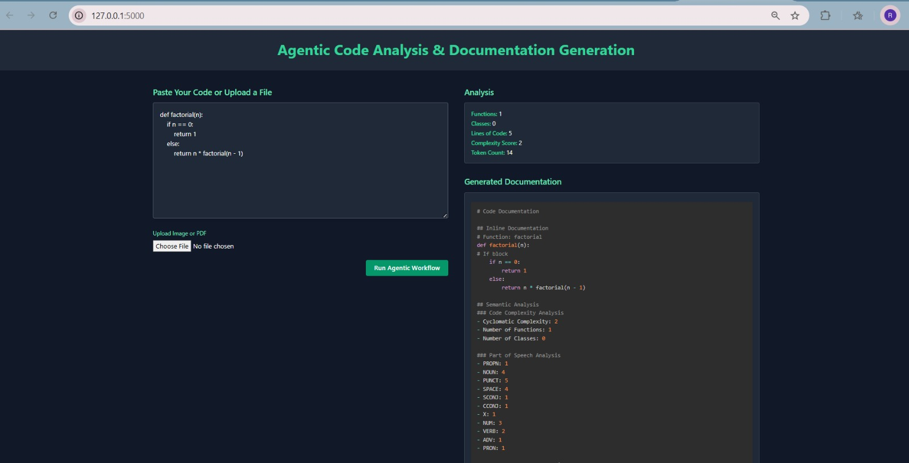

# Real-Time Collaborative Code Documentation System

An AI-powered platform for generating, managing, and code documentation in real time. This system leverages advanced NLP, RAG (Retrieval-Augmented Generation), and multi-modal input to streamline and enhance the documentation process for developers and teams.

---

## 🚀 Features

- 🤖 **AI-powered code documentation generation**
- 🎤 **Multi-modal input support** (text, voice, images, PDFs)
- 🔍 **Advanced NLP and RAG capabilities** for context-aware documentation
- 📊 **Evaluation framework** for documentation quality
- 🧠 **Code analysis and semantic search**
- 🗂️ **Dataset and model management**

---

## 🖥️ Demo

> Paste your code or upload a file (image, PDF, or Python script) in the web UI and click "Run Agentic Workflow" to generate documentation and analysis instantly.

---

## 🖼️ Example Output



*Sample output generated by the system.*

---

## ⚡ Quickstart

1. **Clone the repository:**
   ```bash
   git clone https://github.com/Ramala-Bhavikatti/Automated-Code-Documentation.git
   cd GenAI
   ```
2. **Install dependencies:**
   ```bash
   pip install -r requirements.txt
   ```
3. **Set up environment variables:**
   - Copy `.env.example` to `.env` and edit as needed.
4. **Initialize the database:**
   ```bash
   python scripts/init_db.py
   ```
5. **Run the development server:**
   ```bash
   PYTHONPATH=. python app.py
   ```
6. **Access the app:**
   - Open your browser and go to `http://localhost:5000`

---

## 🛠️ Project Structure

```
├── app/
│   ├── api/            # API endpoints
│   ├── models/         # Database and ML models
│   ├── services/       # Business logic and AI services
│   ├── utils/          # Utility functions
│   └── templates/      # Frontend templates (web UI)
├── config/             # Configuration files
├── data/               # Datasets
├── models/             # ML model storage
├── scripts/            # Utility scripts (indexing, training, etc.)
├── tests/              # Test files
├── app.py              # Main application entry point
├── requirements.txt    # Python dependencies
└── README.md           # Project documentation
```

---

## 📚 Usage

- **Web UI:**
  - Paste code or upload files (Python, image, PDF) and generate documentation with a click.
- **API:**
  - Use the `/agentic-workflow` endpoint to submit code/files and receive documentation and analysis (see `app/api/routes.py`).
- **Model Training & Indexing:**
  - Use scripts in `scripts/` to train models or build code search indices.

---

 